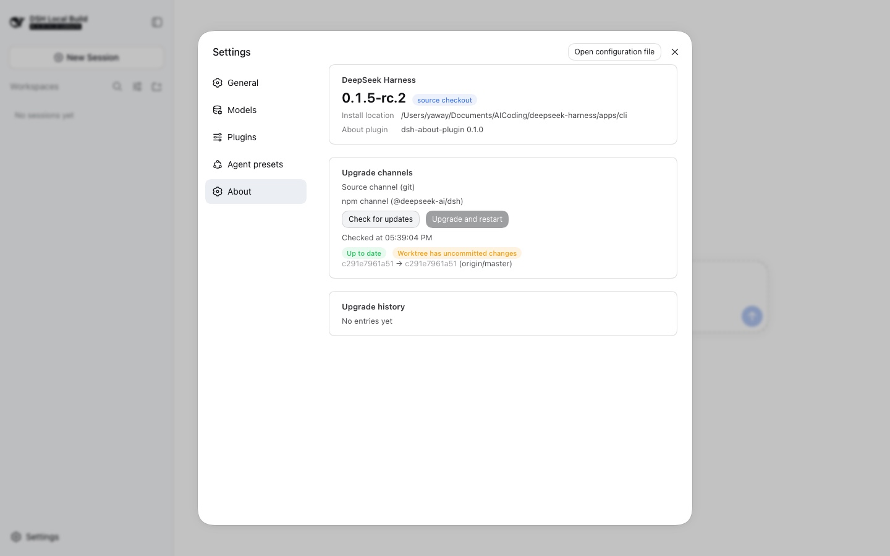

# dsh-about-plugin

DeepSeek Harness 的「关于」面板与自助升级插件：在 Web 设置对话框中展示版本事实、按渠道检查更新，并通过受监督的脱离进程完成源码升级与重启。



> 截图：设置 → 关于。版本卡片（版本 / 源码安装形态 / 安装位置 / 插件版本）、双渠道检查结果（「已是最新」+「工作树有未提交修改」+ SHA 对比），以及底部的升级记录。此例中工作树有未提交改动，故「升级并重启」保持禁用。

```
设置 → 关于
├── DeepSeek Harness    版本 / 安装形态 / 安装位置 / 插件版本
├── 升级渠道            源码渠道（git）与 npm 渠道，检查按钮 + 待更新提交预览
├── 升级并重启          风险确认 → 受监督升级 → 自动重连
└── 升级记录            $DSH_HOME/update-log.jsonl 的尾部条目
```

## 安装

```bash
dsh plugin --profile web add /path/to/dsh-about-plugin
# 重启 dsh 后生效（安装只是新增惰性依赖，不触碰运行中的进程）
```

卸载：`dsh plugin --profile web remove dsh-about-plugin`。

## 架构

一个包、两半、五个构建产物（`pnpm run build` 先 tsc 输出到 `lib/types` —— 该趟同时把标准装饰器 `@Remote` 降级为 `__esDecorate` —— 再由 tsdown 打包）：

| 产物 | 角色 |
| --- | --- |
| `lib/index.js` | 宿主半：`UpdateGateway extends TypertRemoteService`，服务键 `update`，方法 `status` / `check` / `apply` |
| `lib/typert.js` | 手写 TYPERT 宿主工件（`./typert` 导出），dsh-typert-loader 挂载 Loader 行时注册，为每个 `update/*` 端点提供严格网关校验 |
| `lib/remote.js` | 手写 TYPERT_REMOTE 客户端工件（`./remote` 导出），浏览器半自己 `ctx.remote.$mount()` 挂载 |
| `lib/supervisor.js` | 脱离的升级监督进程，仅 Node 内建依赖（它运行时正要改写自己所在的树） |
| `lib/client.js` | 浏览器闭包工厂包（`window.__ModuleLoader__.load`），除冻结平台表（React、cordis、静态 UI 库）外全部内联 |

手写工件逐字段对齐 `dsh-typert-generator` 为包内插件生成的形状（对照 `@deepseek-ai/dsh-host-plugin-inventory` 的 `lib/typert.host.js` / `lib/typert.remote-client.js`）：独立插件没有仓库代码生成管线，但不损失严格校验。两份工件的 zod schema 同源于 `src/schemas.ts`，不会漂移。

### 升级时序（核心安全规则）

**源码树与 node_modules 绝不在活进程下被改动。** `apply` 依序：

1. 预检（干净工作树 + 源在允许清单内），失败即拒绝、不动任何东西；
2. 快照本次启动器调用（execPath + execArgv + argv + cwd）写入计划文件；
3. 向 `$DSH_HOME/update-log.jsonl` 追加 `started`；
4. 脱离式（detached）spawn `node lib/supervisor.js <plan>`；
5. 调用 `ctx.get('appExit')?.()` 让本面优雅退出。

监督进程等待记录的 pid 全部退出后，按**固定命令表**执行：`git fetch` → `git pull --ff-only` → `pnpm install` → `pnpm run build` → 重启快照的启动器。任一步失败则回滚到记录的 SHA（reset --hard + 重装 + 重建）再重启。每一步前后都写状态文件；重启后的新进程在挂载时把 `restarted` 补写为 `verified`，把死掉的半途尝试标记为 `orphaned`。

命令表只含 git/pnpm/构建/重启器，绝不执行来自远端内容的命令。默认允许清单钉死官方源：

```
https://github.com/deepseek-ai/deepseek-harness.git
git@github.com:deepseek-ai/deepseek-harness.git
```

## 配置（Loader 行 config）

| 键 | 默认 | 说明 |
| --- | --- | --- |
| `trackedRef` | `master` | 源码渠道跟踪的 ref |
| `originAllowlist` | 官方源清单 | 允许 fetch/pull 的 git origin |
| `npmPackage` | `@deepseek-ai/dsh` | npm 渠道读取的包 |
| `npmDistTag` | `latest` | npm 渠道读取的 dist-tag |
| `incomingLimit` / `dirtyFileLimit` | 20 | 变更预览上限 |
| `historyLimit` | 30 | 面板读取的状态文件条数 |

## 为什么没有引擎委托

`apply` **只走插件本地序列**。官方 dsh 从未承诺过升级引擎（无 roadmap、无 issue、无 release note），预埋一条对不存在接口的调用（猜命令名、猜输出 schema）是投机：官方将来若用别的命令名，它是死代码；若恰好同名而语义不同，探测命中后打进未知接口，行为不可预期。若官方引擎真的落地，委托逻辑届时按其**真实文档**补在这里即可（约 30 行）。

## 开发

```bash
pnpm install   # prepare 链接同级 deepseek-harness 检出中的 @deepseek-ai/* 对等依赖（DSH_ABOUT_HARNESS_CHECKOUT 可覆盖）
pnpm test      # 83 项：版本比较、安装识别、渠道探测、状态文件、监督进程（真实产物级集成）、RPC schema、组件
pnpm run build # tsc → lib/types，tsdown → 五个产物
node scripts/verify-browser.mjs "<带 token 的服务器 URL>" [截图目录]   # 浏览器级端到端验证
```

`verify-browser` 的 playwright 取自同级 deepseek-harness 检出（`apps/web` 的 devDependency）；`DSH_ABOUT_HARNESS_CHECKOUT` / `DSH_ABOUT_PLAYWRIGHT` 可覆盖解析锚点。

对等依赖在**运行时**通过 profile 模块回退（`$DSH_HOME/profiles/node_modules`）解析，与 `@yaways/dsh-subagent-claude-code-wrapper` 的先例一致；本地开发由 `scripts/link-dev-deps.mjs` 提供同样的解析（无同级检出时优雅跳过，git 克隆安装不受影响）。

## 已验证（本轮）

- 一次性 profile（`DSH_HOME=/tmp/...`）真实安装 + 启动；
- 启动图（`window.__DSH_BOOT__`）含 `dsh-about-plugin` 行与正确的 inject 边；`/plugins/??dsh-about-plugin/client.js` 可取；
- HTTP RPC：`update/status`（版本事实）、`update/check`（真实网络 fetch、领先/落后/脏树判定）、`update/apply`（脏树安全拒绝）全部往返；
- Playwright 浏览器级：设置 → 关于 打开、版本/形态/插件版本渲染、检查按钮真实 RPC、脏树提示、升级按钮禁用、零页面错误。

## 限制

- npm 渠道目前只做**比较展示**（不执行升级）；打包可执行文件自带更新生命周期，插件只报告形态。
- 升级序列**只等本面自己的 pid**：同一源码 checkout 上若还跑着其他 dsh 面（headless、第二个 web），它们存活期间树仍会被改写。多面协调停机需要上游 pid 注册表（官方未规划）；短期缓解是把同锚点进程纳入等待。
- `engines.dsh` 为 `>=0.1.0`，声明性下限（当前没有需要拒绝的旧版本）。
